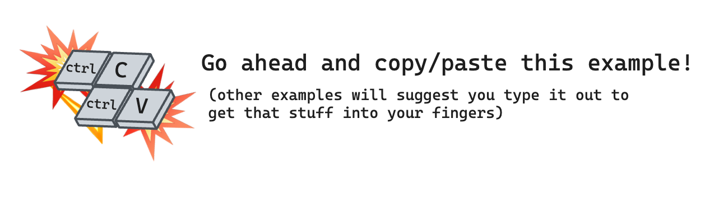
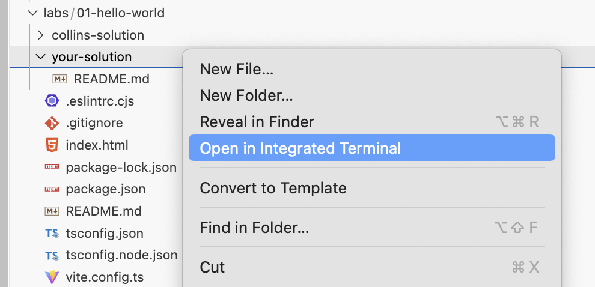
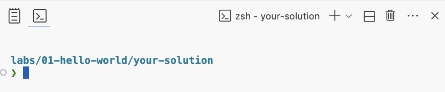
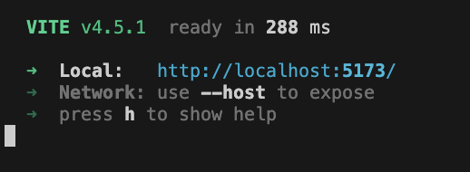
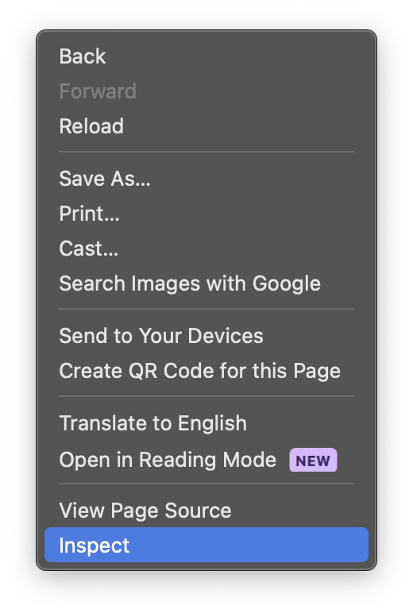
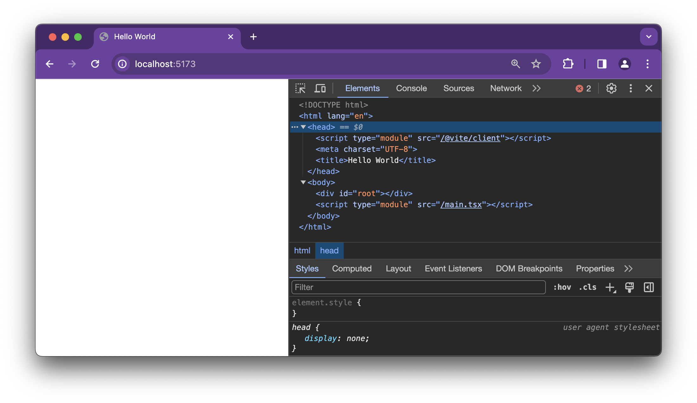

# Lab 01: Hello World

Let's get started with react.

For this lab, we're using the `vite` bundler. There'll be quite a bit unexplained in this lab. We're looking to build something small,but functional.

If you don't wholly understand what you're doing, that's okay. **_Bring those questions to the review_** We'll dig deeper into every part of this throughout the lectures and labs to follow.

For this lab, you'll be making all your changes, and doing all your work from the `labs/01-hello-world/your-solution` directory

The first thing we'll need is an `index.html` in that folder.

> 

```html
<!DOCTYPE html>
<html lang="en">
  <head>
    <meta charset="UTF-8" />
    <title>Hello World</title>
    <script defer type="module" src="/main.tsx"></script>
  </head>
  <body>
    <div id="root"></div>
  </body>
</html>
```

In that file, pay close attention to two elements in particular:

- ```html
  <script defer type="module" src="/main.js">
  ```
- ```html
  <div id="root">`</div>
  ```

>  You might have questions about those elements, make a note and bring them to review. Or if you finish the lab early, that's a good time to do some searching.

That html file references a `main.js` file. You'll also need to create that file in your solution folder.

To get started, we're going to need a terminal to build and serve our react code.

A quick way to get a terminal open is to right click on `labs/01-hello-world/your-solution` in the VSCode file explorer and click "Open in Integrated Terminal"



You should see something like this:



In that terminal, start the vite dev server.

```terminal
npx vite dev
```

You should see this output indicating vite is bundling and serving your code at `localhost:5173`



If you open that page, and open your browser's dev tools...



You'll see your html has been loaded.


