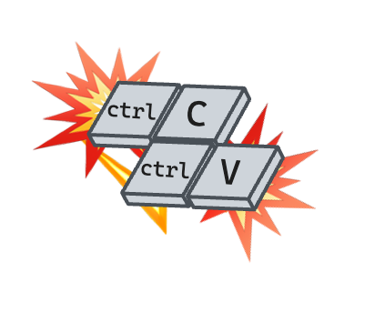

# Lab 01: Hello World

<link rel="stylesheet" href="../../.images/styles.css"></link>

Let's get started with react.

For this lab, we're using the `vite` bundler. There'll be quite a bit unexplained in this lab. We're looking to build something small,but functional.

If you don't wholly understand what you're doing, that's okay. **_Bring those questions to the review_** We'll dig deeper into every part of this throughout the lectures and labs to follow.

For this lab, you'll be making all your changes, and doing all your work from the `labs/01-hello-world/your-solution` directory

The first thing we'll need is an `index.html` in that folder.

> 
> <div style="padding-top: 10px;">Go ahead and copy/paste this example. Later examples will call out when to type it out by-hand</div> <br style="clear: both">

<br>

```html
<!DOCTYPE html>
<html lang="en">
  <head>
    <meta charset="UTF-8" />
    <title>Hello World</title>
    <script defer type="module" src="/main.tsx"></script>
  </head>
  <body>
    <div id="root"></div>
  </body>
</html>
```

In that file, pay close attention to two elements in particular:

- ```html
  <script defer type="module" src="/main.js">
  ```
- ```html
  <div id="root">`</div>
  ```

<aside note>
 You might have questions about those elements, make a note and bring them to review. Or if you finish the lab early, that's a good time to do some searching.
</aside>

That html file references a `main.js` file. You'll also need to create that file in your solution folder.

To get started, we're going to need a terminal to build and serve our react code.

A quick way to get a terminal open is to right click on `labs/01-hello-world/your-solution` in the VSCode file explorer and click "Open in Integrated Terminal"


You should see something like this:


In that terminal, start the vite dev server.

```terminal
npx vite dev
```

<aside note>
 `npx` is a tool that comes with `npm`. It's a way to run a command without installing it globally. If you have questions about `npx` bring them to review.
</aside>

You should see this output indicating vite is bundling and serving your code at `localhost:5173`


If you open that page, and open your browser's dev tools...


You'll see your html has been loaded.


Now we're ready to start writing some react code.


<br>

In `main.js` we're going to import the `react` and `react-dom` libraries. These have already been installed in this repository, so you don't need to do anything to install them. But typically this would be done with `npm install react react-dom`

```js
import React from "react";
import ReactDOM from "react-dom/client";
```

Next, we'll need to get a reference to the `div` with the id of `root` in our html. And we'll need to create a react root targeting thaht element.

```js
const root = document.getElementById("root");
const reacetRoot = ReactDOM.createRoot(root);
```

Now we're ready to render our first react component to that root:

```js
ReactDOM.render(<h1>Hello World</h1>, root);
```

Go ahead and save that file, and you should see your browser reload with the new content.
